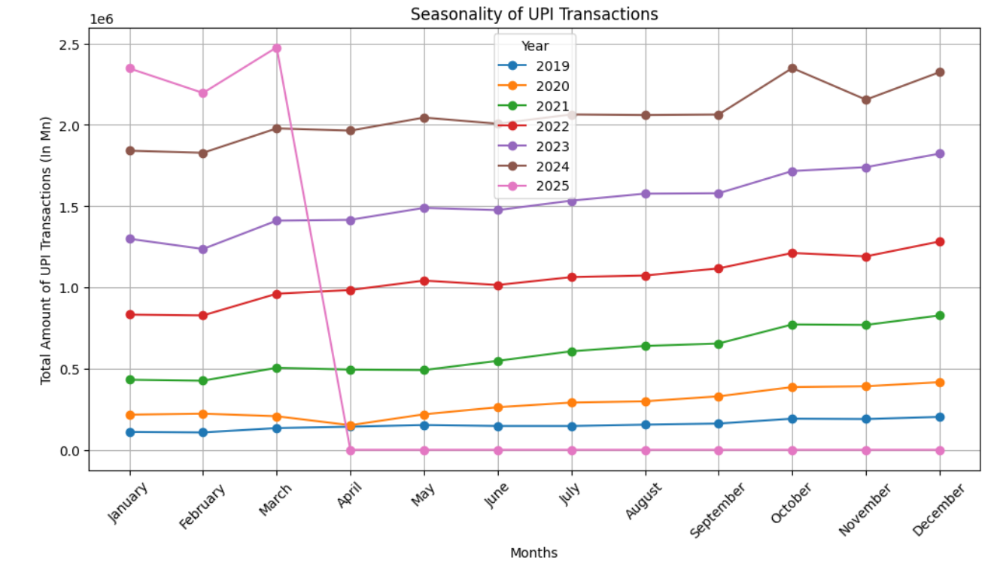
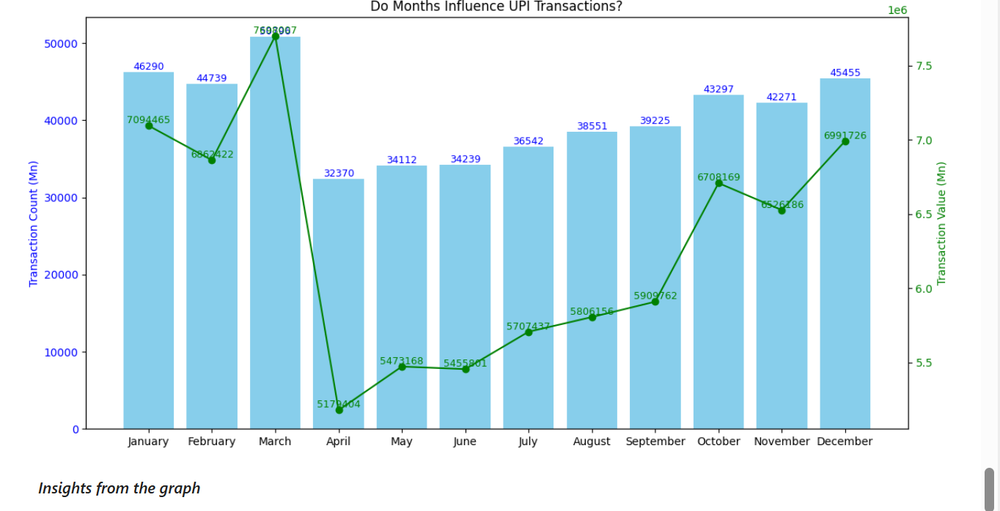
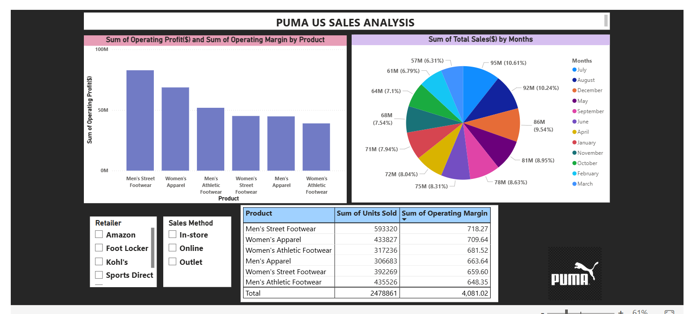
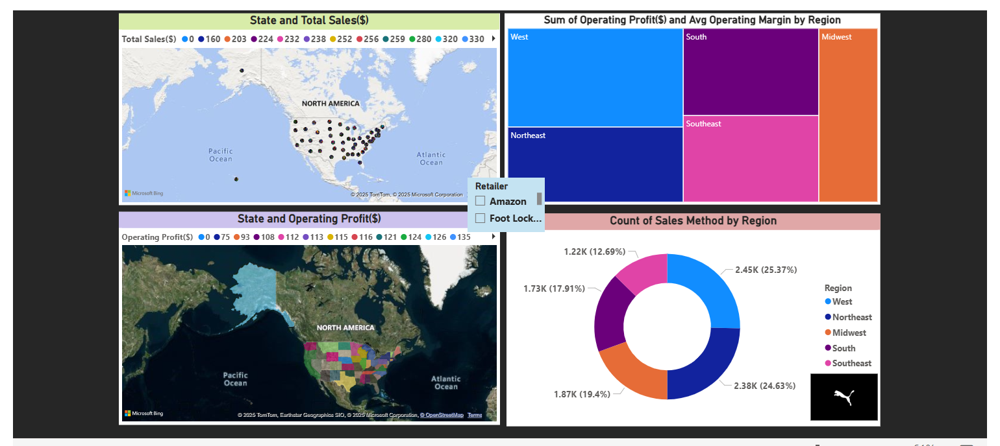

## **Hii! I’m Lakshita Rawat from New Delhi, India**
Hi! I’m Lakshita, a Computer Science graduate focused on data analytics, analytics engineering, and data-driven problem solving. I build end-to-end projects using Python, SQL, Power BI, Excel, and modern analytics workflows to analyze data, generate insights, and support business and technical decision-making.
 
## Project 1: [TransactIQ – Forecasting India’s Journey Beyond Cash with UPI](https://lakshita-03.github.io/TransactIQ/)
 

   

### Summary
TransactIQ focuses on modeling and forecasting the growth of UPI transactions in India using historical transaction data. The project examines long-term adoption trends, seasonal fluctuations, and structural shifts in user behavior, particularly before and after the COVID-19 period. I curated multi-year UPI datasets, performed trend and seasonality analysis, and built an ARIMA-based time-series forecasting model to predict future transaction volumes. The analysis highlights sustained digital payment growth, recurring seasonal spikes, and the increasing dominance of UPI over traditional payment modes.

### Tech & Methods
- Python (Pandas, NumPy)
- Time Series Forecasting (ARIMA)
- Trend & seasonality analysis
- Data visualization (Matplotlib, Seaborn)

 

## Project 2: [Sportswear Meets Data: Analyzing Puma’s Market Performance](https://lakshita-03.github.io/PUMA/)
 

  

### Summary
This project evaluates PUMA’s sales performance in the U.S. sportswear market with a strong emphasis on competitor analysis and market positioning. The objective was to understand how PUMA performs relative to key competitors across pricing, product mix, and regional demand. Using 50,000+ sales records, I analyzed category-level performance, regional revenue distribution, and customer demand patterns. I conducted competitor benchmarking to identify pricing gaps and product positioning differences against market leaders, uncovering opportunities for differentiation in premium and mid-range segments. Based on these insights, I proposed data-backed pricing and positioning strategies with an estimated 8–10% potential revenue uplift.

### Tech & Methods
- Exploratory Data Analysis (EDA)
- Competitor benchmarking & pricing analysis
- Data visualization (Matplotlib, Seaborn)
- Power BI dashboards for market comparison
  

